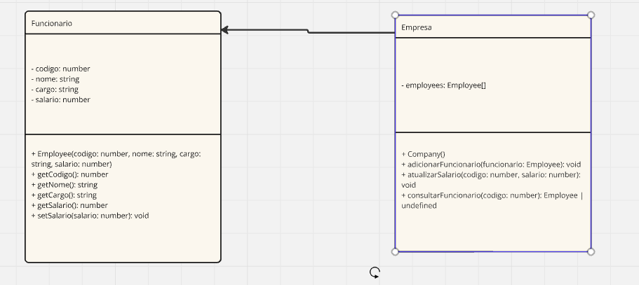

## Executar
1. Instale as dependências:

    ```bash
    npm install
    ```

2. Compile o código TypeScript:

    ```bash
    npx run dev
    ```
## Diagrama UML

PS: A implementação foi realizada em inglês, de forma a ter mais familiaridade com a linguagem.


## Teste

O código cria uma instância da `Biblioteca`, adiciona três livros, realiza um empréstimo e verifica a disponibilidade dos livros.
Sendo que, primeiro cria os livros com a função "registerBooks", depois retira o "Entrevista com o Diabo", e depois verifica a disponibilidade com o "checkAvailability", retornando unavalable, e depois verifica a disponibilidade do "O Gladiador", que retorna available.
